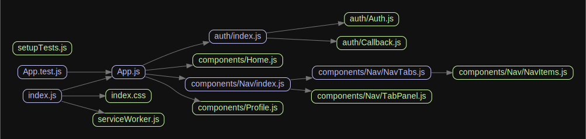

# react-auth0

## Auth(history) ⇒ <code>Object</code>
**Kind**: global function  
**Returns**: <code>Object</code> - `{ login, handleAuthentication }`  

| Param | Type | Description |
| --- | --- | --- |
| history | <code>\*</code> | history object |

